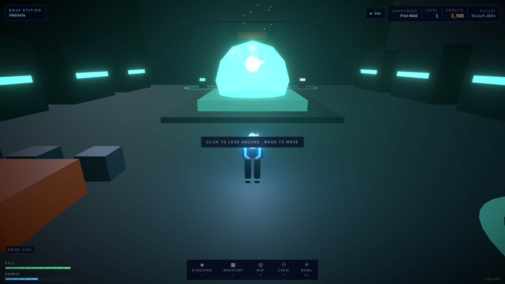
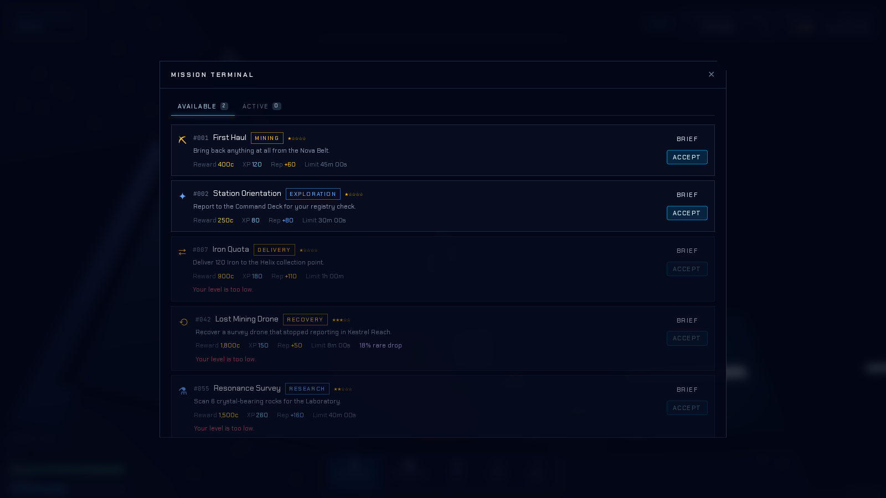
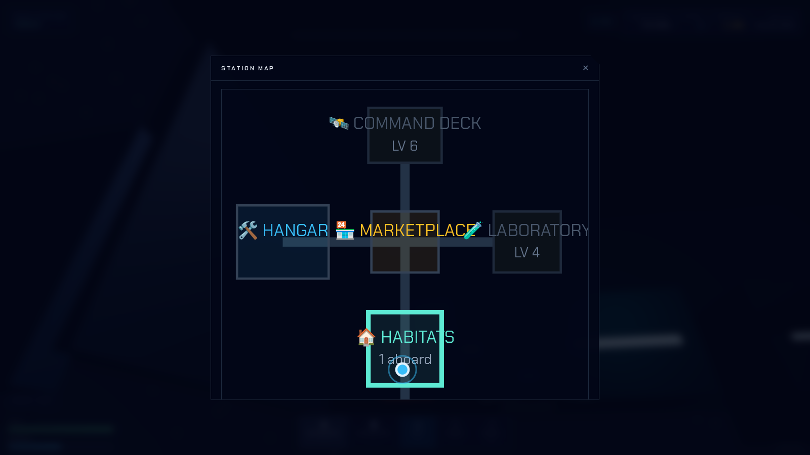
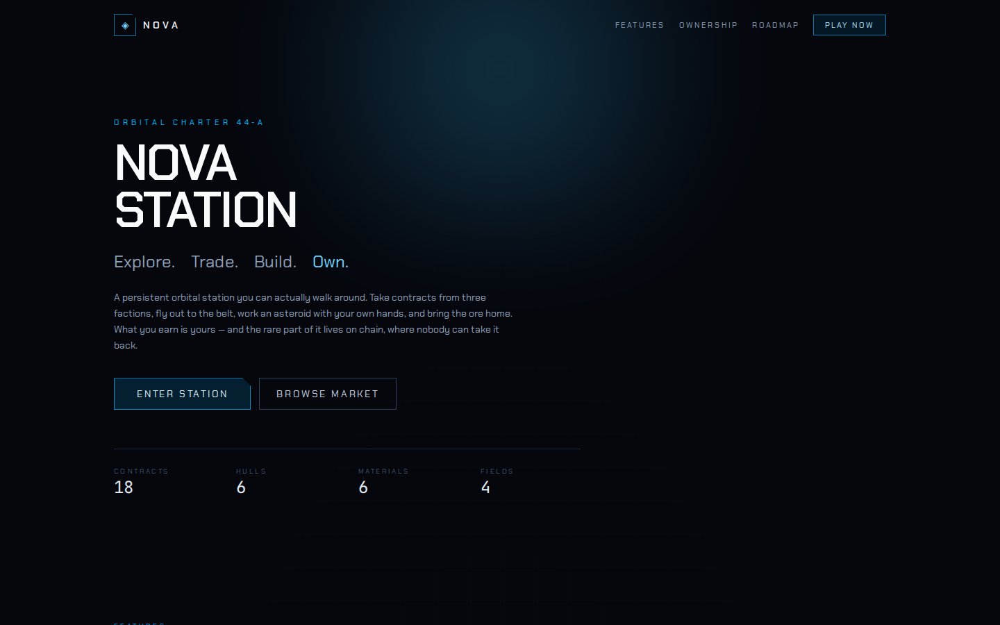

# NOVA STATION

**A browser-based 3D Web3 space station metaverse.** Walk the decks of a persistent orbital
station, take contracts from three rival factions, fly out to the belt and work an asteroid with
your own hands, refine what you bring back, craft, trade — and own the rare part of it on chain.

Built with Next.js, React Three Fiber and Three.js on the front, an authoritative Fastify + Prisma
game server behind it, and OpenZeppelin contracts targeting Sepolia for the parts where ownership
actually matters. The contracts run against a local chain today; Sepolia deployment needs a funded
key, which this repository does not contain — see [docs/DEPLOYMENT.md](docs/DEPLOYMENT.md).

```
Connect wallet → Create avatar → Enter station → Explore → Mine → Contracts
      → Upgrade ship → Craft → Trade → Marketplace → Progress → Own
```

---

## Screenshots

| | |
|---|---|
| **The station** — third-person, one continuous deck plan, live multiplayer |  |
| **Mission terminal** — every contract generated from data, gates explained |  |
| **Station map** — drawn from the same layout the 3D world is built from |  |
| **Landing page** |  |

---

## What is actually here

**A real 3D world.** Seven sectors — Command Deck, Hangar, Marketplace, Laboratory, Habitats,
Mining Bay, Docking Bay — laid out on one continuous plane connected by corridors and walkable
ramps. No loading screens between them, no teleports. The geometry is generated from a single
declarative layout that the renderer, the client's collision system *and the server's movement
validator* all read, so the wall you can see is exactly the wall the server will stop you at.

**A character you control.** Third-person controller with gravity, jumping, step-up over kerbs and
crates, sloped ramps, an exact swept collision test that cannot tunnel through a wall at any frame
rate, and a camera that pulls in when geometry gets between it and you.

**Mining that is a game, not a button.** Launch from the Docking Bay, fly a real ship through a
procedurally laid-out asteroid field, pick a rock and hold a drifting resonance band while the beam
cuts. Playing it well is worth up to 45% more ore. Playing it impossibly is worth exactly as much
as playing it perfectly — see [SECURITY.md](SECURITY.md).

**An economy with sources and sinks.** Six materials, a refinery, a station broker with a spread, a
player exchange with fees, ship upgrades, fuel, crafting costs. Every credit that moves leaves a
row in an append-only ledger, and any balance can be reconstructed from it.

**Live multiplayer.** See other commanders walking the deck, interpolated from 10 Hz snapshots with
interest management. Area and station chat, emotes, friends, presence.

**Hybrid Web3.** ERC-721 for unique hulls and collectibles, ERC-1155 for rare modules, equipment and
cosmetics, an escrowed marketplace with pull payments, and a reward vault redeemed against
EIP-712 vouchers. Ownership, provenance and trade go on chain. Mining runs do not.

---

## Tech stack

| Layer | Choice | Why |
|---|---|---|
| 3D | Three.js 0.185 via React Three Fiber 9 | The world is a React tree; the render loop is not |
| Client | Next.js 15, React 19, Tailwind 4, Zustand 5 | App Router, server-rendered landing, tiny client state |
| Server | Fastify 5, `ws`, Prisma 7, PostgreSQL 16 | Fast, typed, transactional |
| Chain | Solidity 0.8.28, OpenZeppelin 5.6, Foundry | Audited primitives, fast fuzzed tests |
| Wallet | wagmi 2 + viem 2, SIWE (EIP-4361) | No private keys ever reach the app |
| Tests | Vitest, Foundry, Playwright | 415 tests across six suites |

Geometry is generated in code. Audio is synthesised in the browser from oscillators and shaped
noise. **There are no binary assets to download and nothing licensed from anyone** — the whole
world is a few hundred kilobytes of JavaScript.

---

## Architecture at a glance

```
              browser                          server                    chain
   ┌───────────────────────────┐    ┌────────────────────────┐    ┌────────────────┐
   │  Next.js · React Three    │    │  Fastify REST          │    │  NovaAssets    │
   │  Fiber · Zustand          │◀──▶│  ws gateway (10 Hz)    │    │  NovaItems     │
   │                           │    │  Prisma · PostgreSQL   │◀──▶│  NovaMarket    │
   │  @nova/game-engine ───────┼────┼──▶ same engine, used   │    │  NovaVault     │
   │  (prediction)             │    │    to validate         │    └────────────────┘
   └───────────────────────────┘    └────────────────────────┘             ▲
                │                              │  indexer ─────────────────┘
                └──── wallet (wagmi/viem) ─────┴──── signs its own transactions
```

The client and the server share `@nova/game-engine` and `@nova/game-data`. Prediction and
validation are literally the same functions. Full detail in
[docs/ARCHITECTURE.md](docs/ARCHITECTURE.md).

---

## Local setup

**Requires** Node ≥ 20.11, pnpm ≥ 9, Docker (for Postgres), and
[Foundry](https://book.getfoundry.sh/getting-started/installation) if you want the contracts.

```bash
git clone <this repo> nova-station && cd nova-station
pnpm install

# 1. Postgres + Redis on non-default ports (5491 / 6391) so they can sit
#    alongside anything else you run.
pnpm db:up

# 2. Environment
cp .env.example apps/server/.env          # then fill in as noted in the file
cp .env.example apps/web/.env.local

# 3. Schema and static content
pnpm db:migrate
pnpm db:seed

# 4. Build the shared packages, then run both apps
pnpm dev
```

- Web: <http://localhost:3300>
- API: <http://localhost:4300> (`/health` for a liveness check)

> **Use the same hostname for both.** The session cookie is `SameSite=Lax` in development, so
> visiting the app on `127.0.0.1` while the API is on `localhost` makes the browser treat them as
> different sites. The API also accepts a bearer token, so it still works — but `localhost`
> everywhere is the simpler path.

### With contracts (optional)

```bash
pnpm chain:node                # anvil on 8545, in another terminal
pnpm chain:deploy:local        # writes contracts/deployments/31337.json
# copy those addresses into apps/server/.env and apps/web/.env.local
```

Without them the game is fully playable; the on-chain panels report themselves unconfigured
instead of pretending to work.

---

## Environment variables

Every variable is documented inline in [`.env.example`](.env.example) — what it does, which of the
three `.env` files it belongs in, and which ones are required in production. The server validates
its environment at boot and refuses to start on a bad one rather than failing at the first request.

---

## Database

PostgreSQL via Prisma 7. The schema covers identity and sessions, avatars, inventory, ships and
their upgrades and fitted modules, faction standing, contracts, expeditions, crafting jobs,
marketplace listings, the indexed mirror of on-chain assets, friendships, chat, play sessions and
an append-only credit ledger.

```bash
pnpm db:migrate     # create/apply a migration
pnpm db:seed        # mirror the static catalogues into reference tables
pnpm db:studio      # browse it
pnpm db:reset       # drop and rebuild
```

Schema notes and the reasoning behind the reference/authoritative split are in
[docs/ARCHITECTURE.md](docs/ARCHITECTURE.md#database).

---

## Smart contracts

Four contracts, all OpenZeppelin-based, all with role-based access control, pausing, reentrancy
guards, custom errors and events:

| Contract | Standard | Purpose |
|---|---|---|
| `NovaAssets` | ERC-721 + Enumerable | Unique hulls and collectibles, with on-chain provenance |
| `NovaItems` | ERC-1155 + Supply | Rare modules, equipment, cosmetics; ids must be curated before minting |
| `NovaMarketplace` | — | Escrowed listings in ETH, pull payments, collection allowlist |
| `NovaRewardVault` | EIP-712 | Rewards redeemed against a server-signed voucher |

```bash
pnpm --filter @nova/contracts test         # 106 tests including fuzz + reentrancy
pnpm --filter @nova/contracts coverage
pnpm chain:deploy:sepolia                  # needs SEPOLIA_RPC_URL and PRIVATE_KEY
```

Design decisions — escrow over approval, pull over push, why the allowlist exists — are in
[docs/WEB3.md](docs/WEB3.md).

### Sepolia

Set `CHAIN_ID=11155111`, point `RPC_URL`/`NEXT_PUBLIC_RPC_URL` at a Sepolia endpoint, deploy with
`pnpm chain:deploy:sepolia`, and copy the resulting addresses into both `.env` files. Fund the
deployer from a faucet first. Sepolia ETH has no monetary value; the point is to demonstrate the
ownership model end to end.

**Deployed addresses:** see [docs/DEPLOYMENT.md](docs/DEPLOYMENT.md#deployed-addresses).

---

## Testing

```bash
pnpm test              # unit + contract suites
pnpm test:unit         # game-data, game-engine, shared, server, web
pnpm test:contracts    # Foundry
pnpm test:e2e          # Playwright, needs both apps running
pnpm verify:all        # typecheck, lint, every suite, production build
```

| Suite | Tests | Covers |
|---|---:|---|
| `@nova/game-data` | 16 | Content integrity, geometry, doorways, progression maths |
| `@nova/game-engine` | 125 | Collision, controller, mining, crafting, missions, economy |
| `@nova/shared` | 27 | Protocol validation, TypeScript↔Solidity id agreement |
| `@nova/web3` | 18 | SIWE parsing, EIP-712 vouchers, transaction states |
| `@nova/contracts` | 106 | Mint, transfer, marketplace, fees, roles, reentrancy, fuzz |
| `@nova/server` | 99 | Auth, gameplay, anti-cheat, marketplace, multiplayer |
| `@nova/web` | 19 | Interpolation, formatting |
| E2E | 5 | The whole journey, in a browser, with a real signing wallet |

---

## Production deployment

The server is a stateless Node process behind Postgres; the web app is a standard Next.js build.
Step-by-step instructions, the reverse-proxy and WebSocket requirements, the cookie/CORS
considerations for a split-origin deployment and a pre-flight checklist are in
[docs/DEPLOYMENT.md](docs/DEPLOYMENT.md).

---

## Documentation

| | |
|---|---|
| [ARCHITECTURE.md](docs/ARCHITECTURE.md) | Monorepo layout, data flow, engine design, database |
| [GAME_DESIGN.md](docs/GAME_DESIGN.md) | The loop, progression, factions, content |
| [ECONOMY.md](docs/ECONOMY.md) | Sources, sinks, rarity, fees, sustainability |
| [SECURITY.md](SECURITY.md) | Threat model and every mitigation |
| [MULTIPLAYER.md](docs/MULTIPLAYER.md) | Protocol, snapshots, interest management, validation |
| [WEB3.md](docs/WEB3.md) | The on/off-chain split, contracts, indexer, transaction UX |
| [DEPLOYMENT.md](docs/DEPLOYMENT.md) | Local, Sepolia and production |
| [CONTRIBUTING.md](CONTRIBUTING.md) | Conventions and how to add content |

---

## Known limitations

Written plainly, because a portfolio project that pretends to have no edges is not worth reading:

- **Single game server.** Presence and the live world live in one process's memory. Horizontal
  scaling needs a shared presence store (Redis is already in the compose file for this) and sticky
  or sharded socket routing.
- **Movement is soft-authoritative.** The server validates that every reported position is
  reachable, inside the station and not inside a wall, and corrects it otherwise — but it does not
  re-simulate movement from raw input. Nothing of value is granted by movement, so the worst a
  perfect movement cheat achieves is standing somewhere odd.
- **The chain indexer is polling, not streaming.** Fine at Sepolia block times; a busy chain would
  want log subscriptions and a reorg-aware cursor rather than a confirmation delay.
- **No token bridging back off chain.** An item minted on chain stays there. Burning a token to
  return it to the off-chain inventory is designed but not implemented.
- **The mint bridge is not two-phase.** The off-chain copy is burned before the chain call
  returns. If the transaction then fails to send, the player is short an item and reconciliation is
  manual. The right shape is reserve → mint → burn-or-release; see
  [docs/WEB3.md](docs/WEB3.md#the-bridge).
- **Ownable station modules are not built.** Section 31 of the brief scopes a small system —
  private rooms, mining facilities, display rooms — as an optional extension. The contracts could
  carry them as ERC-721 today, but the gameplay and the interiors are not implemented.
- **The reward vault has no in-game claim flow.** The contract, the EIP-712 voucher format and the
  server-side types are complete and tested, but nothing in the interface issues or redeems a
  voucher yet — rewards are granted off chain. It is wired for tournaments that do not exist.
- **Mobile controls are basic.** A touch stick, a look zone and two buttons. Playable, not polished.
- **One station.** Deliberately: depth over map size, as scoped.
- **No audio spatialisation.** Sounds are synthesised in mono at a fixed gain; a footstep across
  the room sounds like a footstep beside you.
- **Combat is flavour, not mechanics.** Combat contracts gate on ship class and hazard rating.
  There is no PvP and no weapon fire.

## Roadmap

Ownable station modules, co-operative expeditions with shared holds, ranked faction seasons,
a second station in a different orbit, and vault-backed tournaments. See the landing page for the
version a player sees.

---

## Licence

MIT.
